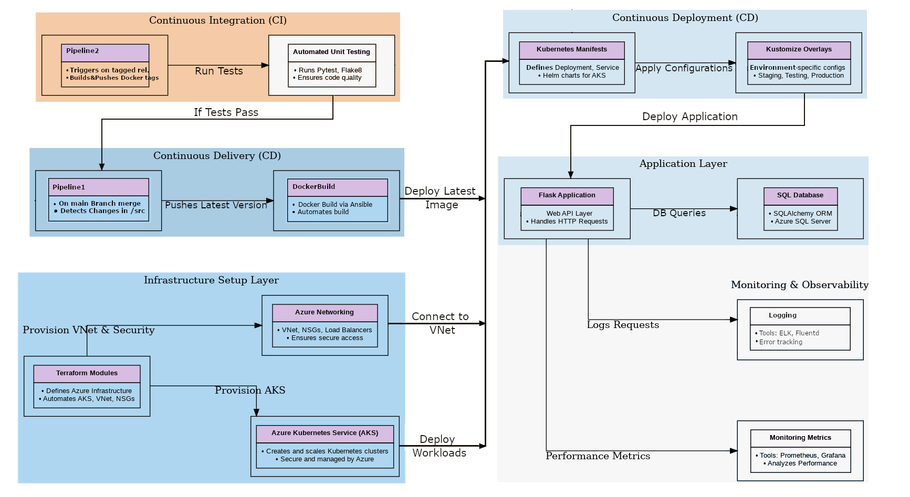

# AKS Deployment Platform

A cloud-native application deployed on Azure AKS with automated CI/CD pipelines.  
**Deploy in 5 minutes!**  

---

## 🚀 Overview  
This project automates:  
- **Infrastructure provisioning** (Azure AKS, networking) using Terraform.  
- **Post-infra configuration** (NSG rules, protocols) via Ansible.  
- **Multi-environment Kubernetes deployments** (e.g., `training`) using Kustomize.  
- **CI/CD pipelines** to build/push Docker images on code changes or version tags.  

---

## 🛠️ Prerequisites  
1. Install:  
   - Azure CLI, Terraform, Ansible, `kubectl`, Kustomize, Docker  
   - Configure Docker Hub, GitHub credentials and ensure Docker is running.
   - Create a ressource group `secrets-rg` for all sensitive components.
   - Create a `AdminSecretsKeyVault` inside `secrets-rg` with RBAC access model
   - Asign `Admin` access for yourself and `Contributor` access for the `webapp` service pricipal.
   - Initialise the framework with `./init.sh`

---

## ⚙️ Quick Deployment Guide  

### 1. Provision Azure Infrastructure  
```bash  
# Terraform plan for the "testing" environment.
./rollout.sh testing     # Creates AKS cluster and networking 
```
### 2. Configure AKS Network Rules
```bash
ansible-playbook fix_aks_nsg.yml  # Fix NSG rules (SSH/HTTP/custom protocols)  
```
### 3. Deploy to Kubernetes

```bash
kubectl apply -k overlays/training  # Deploy using Kustomize overlay  
kubectl get pods -n testing  # Check pod status
``` 
####  **Access the app** (testing): [http://4.158.73.52](http://4.158.73.52)

---
## 🔄 CI/CD Pipelines
### Pipeline 1: Merge to `main` Branch (update latest)
- **Trigger**: Changes to `src/` directory
- **Action**:
  - Builds Docker image.
  - Pushes to Docker Hub **as** `latest` (no version tag).
  - Triggers Kubernetes pods rebuild to pull the latest image. 
### Pipeline 2: Tag in `dev` Branch (e.g., `v2.0.0`) - (no automatic rollout)
- **Trigger**: Trigger: Pushing a semantic version tag:
  ```bash
  git tag v2.0.0 && git push origin --tags  
  ```
- **Action**: 
  - Builds **two Docker tags**:
    - Versioned (e.g., `v3.0.0`).
    - `latest` (updated to match the new version).
  - Older versions (e.g., `v2.0.0`, `v2.0.1`) remain in Docker Hub for rollbacks.
 ---
## 🏷️ Docker Versioning Strategy
- **Docker Hub Tags:**:
  - `latest`: Always points to the newest release (e.g., same as `v3.0.0`).
  - Version tags (e.g., `v2.0.0`): Immutable snapshots for rollbacks.

 **Example**: After tagging `v2.0.1`:
 ```bash
 Docker Hub Tags: v2.0.0 (old), v2.0.1 (new), latest (same as v2.0.1)  
 ```
 ## 📂 Project Structure
 ```bash
 base/ 
 ├── .github/workflows/      # GitHub Actions pipelines:  
 │   ├── build-push-on-main.yml       # Trigger on merge to main  
│   └── docker-build-push-on-tag.yml # Trigger on version tags  
├── kubernetes/
│   ├── base/
│   └── overlays/         # Kubernetes environment configs (e.g., testing)              
├──terraform/             # Terraform environment setup (e.g., AKS)              
│  └── modules/
│      ├── aks/
│      └── network/ 
├── src/                  # App folder containing the Dockerfile
│   └── Dockerfile  
├── init.sh               # Creates full project framework with all files folders.
├── rollout.sh            # Terraform/Kustomize deployment script      
└── deploy.sh             # (Optional) Kubernetes post-deployment script      

```

## 💡 Troubleshooting
- **Rollback to a version**:
  ```bash
  kubectl set image deployment/flask-app-deployment -n testing flask-app=your-dockerhub-image:v2.0.0  
  ```
- **Check pod logs:**:
  ```bash
  kubectl logs -n testing <pod-name>   
  ```
---
*Questions?
Check the framework_code/README.txt for detailed framework documentation.*

